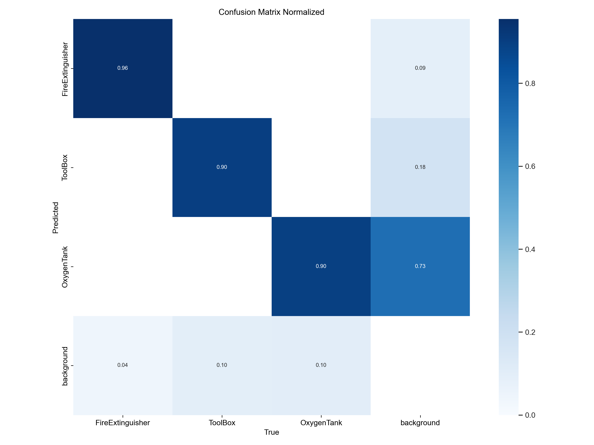

# 🚀 LAIKA: Space Station Object Detection


## 🧠 Project Overview

**LAIKA** is a robust object detection pipeline designed to detect and classify critical equipment in simulated space station environments. Built as part of the [Duality.AI Track](https://duality.ai/) under [HACKBYTE3.0](https://www.hackbyte.in/), it aims to enhance operational safety by identifying objects under challenging conditions such as occlusion, lighting variation, and varying object orientations.

---

## 📂 Dataset

- **Source:** Provided by Duality.AI using FalconEditor
- **Type:** Synthetic images of a space station scene
- **Features:**
  - Varying lighting conditions
  - Occlusions and object overlap
  - Diverse camera angles and distances
- **Target Object Categories:**
  - Toolbox 🧰  
  - Oxygen Tank 🫧  
  - Fire Extinguisher 🔥  

---

## 🧪 Methodology

- **Model Used:** YOLOv8 (Ultralytics)
- **Training Pipeline:**
  - Dataset pre-processing and augmentation
  - Fine-tuning on the labeled synthetic dataset
  - Hyperparameter tuning for optimization
- **Frameworks & Tools:** PyTorch, OpenCV, Albumentations, Ultralytics, Matplotlib

---

## 📊 Evaluation Metrics

- **Accuracy**
- **Precision, Recall, F1-Score**
- **Normalized Confusion Matrix**
- **F1 Curve** (optimal threshold visualization)


---

## 📈 Results
- 📌 Confusion Matrix:
  


- 📈 Normalized Confusion Matrix:


- 🎯 F1 Score Curve:


- **Best F1 Score:** `0.89`
- **Model:** YOLOv8-small (best trade-off between speed and accuracy)
- **Inference Speed:** ~15ms per image (NVIDIA RTX GPU)


---

## 🛠️ How to Run

```bash
# Clone this repository
git clone https://github.com/yourusername/lika-object-detection.git
cd lika-object-detection

# Create a virtual environment
python -m venv venv
source venv/bin/activate  # for Windows: venv\Scripts\activate

# Install dependencies
pip install -r requirements.txt

# Train model using YOLOv8
yolo task=detect mode=train model=yolov8n.pt data=config.yaml epochs=100 imgsz=640

# Run inference on test images
yolo task=detect mode=predict model=best.pt source=./test_images/
